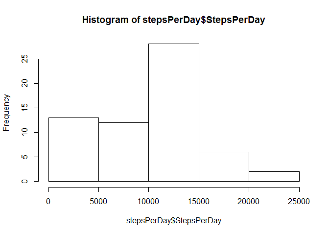
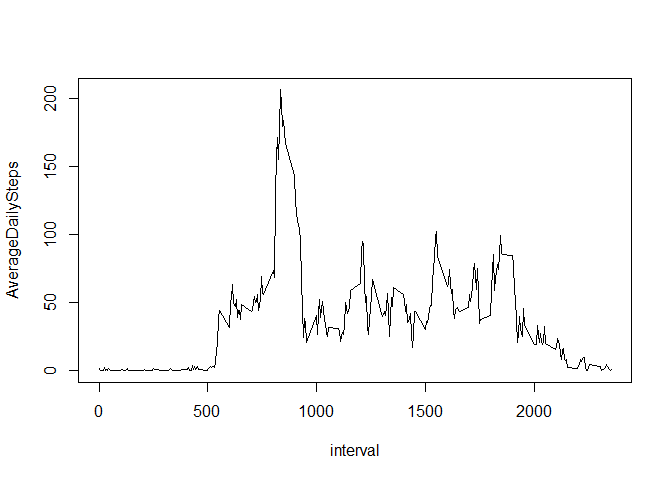
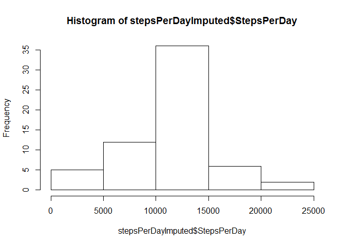
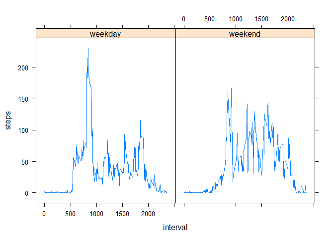

# Assignment1
Chesed  
January 19, 2016  

##Loading and Preprocessing the Data

Read the Data

```r
activityData <- read.csv('activity.csv')
```

Total number of steps taken per day

```r
library(dplyr)
stepsPerDay <- activityData %>%
  group_by(date) %>%
  summarise(StepsPerDay = sum(steps, na.rm = T))
```

A historgram of Steps per Day

```r
hist(stepsPerDay$StepsPerDay)
```

\

## What is mean total number of steps taken per day?

Mean and Median of Steps Per Day

```r
mean(stepsPerDay$StepsPerDay)
```

```
## [1] 9354.23
```

```r
median(stepsPerDay$StepsPerDay)
```

```
## [1] 10395
```

## What is the average daily activity pattern?

Average Daily Activity Pattern

```r
aveDaily <- activityData %>%
  group_by(interval) %>%
  summarise(AverageDailySteps = mean(steps, na.rm = T))
plot(aveDaily, type='l')
```

\

Which 5-minute interval, on average across all the days contains the maximum number of steps?

```r
aveDaily$interval[which(aveDaily$AverageDaily == max(aveDaily$AverageDailySteps))]
```

```
## [1] 835
```

Total number of missing values in the dataset

```r
activityData %>% filter(is.na(steps)) %>% nrow
```

```
## [1] 2304
```

## Imputing missing values

Impute missing values by:
The mean of the 5 minute interval.

```r
activityDataImputed <- activityData %>%
  left_join(aveDaily) %>%
  mutate(steps = ifelse(is.na(activityData$steps), AverageDailySteps, steps)) %>%
  select(-AverageDailySteps)
```

A histogram of Steps per Day for imputed dataset

```r
stepsPerDayImputed <- activityDataImputed %>%
  group_by(date) %>%
  summarise(StepsPerDay = sum(steps, na.rm = T))
hist(stepsPerDayImputed$StepsPerDay)
```

\

## Are there differences in activity patterns between weekdays and weekends?

Mean and Median of Steps Per Day for imputed dataset

```r
mean(stepsPerDayImputed$StepsPerDay)
```

```
## [1] 10766.19
```

```r
median(stepsPerDayImputed$StepsPerDay)
```

```
## [1] 10766.19
```

*The values differ. Imputing values reduce the skewness of the histogram and data looks more normally distributed.

Create Weekday/Weekend factor column

```r
activityDataNew <- activityDataImputed %>%
  mutate(Weekday = weekdays(as.Date(activityData$date))) %>%
  mutate(Weekday = ifelse(Weekday == 'Saturday' | Weekday == 'Sunday', 'weekend', 'weekday')) %>%
  mutate(Weekday = as.factor(Weekday))
```

Create Weekday/Weekend factor column

```r
weekAve <- activityDataNew %>%
  group_by(interval, Weekday) %>%
  summarise(steps = mean(steps))
library(lattice)
xyplot(steps ~ interval | Weekday, data = weekAve, type = 'l')
```

\

